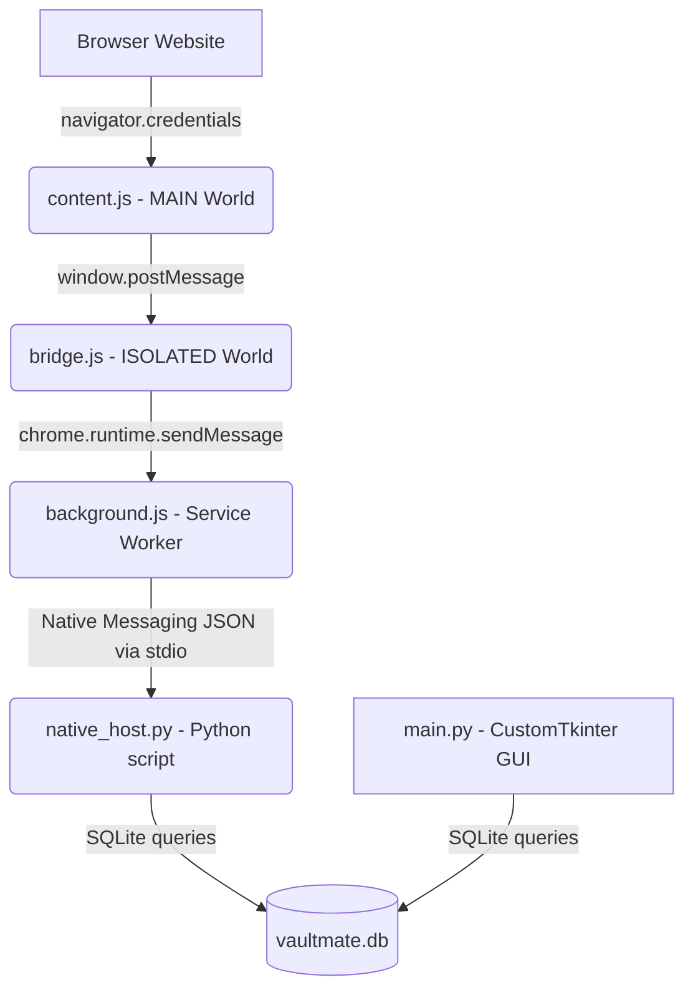

# Product Requirements Document (PRD): VaultMate

## 1. Product Vision
VaultMate is a secure, offline-first, locally-hosted password and passkey manager designed for privacy-conscious users. It features a modern desktop GUI and a companion browser extension. Unlike cloud-based password managers (e.g., Bitwarden, 1Password, LastPass), VaultMate adheres to a strict Zero-Knowledge and Zero-Cloud architecture. All credentials, including WebAuthn passkeys, are stored exclusively on the user's local machine in an encrypted database.

## 2. Target Audience
- **Privacy Advocates:** Users who refuse to store their passwords or private cryptographic passkeys on third-party cloud servers.
- **Developers & Power Users:** Individuals comfortable running local software, Python scripts, and installing unpacked extensions who want total ownership of their data.
- **Linux Users (including Flatpak):** Specifically designed with support for standard Linux environments and heavily sandboxed Flatpak browsers.

## 3. Core Features

### 3.1 Secure Local Storage (Zero-Knowledge Architecture)
- **Database:** Local SQLite database (`vaultmate.db`).
- **Encryption:** All sensitive fields (passwords, cryptographic private keys, public keys) are symmetrically encrypted at rest using `cryptography.fernet`.
- **Key Derivation:** The AES encryption key is derived locally and ephemerally from the user's Master Password using PBKDF2 (100,000 iterations). 
- **No Cloud Sync:** The software contains absolutely no telemetry, analytics, or network-sync capabilities.

### 3.2 Desktop Graphical User Interface (GUI)
- **Framework:** Built using Python and `customtkinter` for a sleek, modern, dark/light mode adaptable interface.
- **Dashboard:** Unified vault view categorizing credentials into "Web Passwords", "App Passwords", and "Passkeys".
- **Management:** Users can add, view, copy, and delete credentials.
- **Browser Integration Hub:** A dedicated UI page to natively connect supported browsers (Chrome, Edge, Brave, Chromium, Firefox). It features a dynamic profile parser that scans the OS (and Flatpak sandboxes) to fetch existing browser profiles (e.g., "Default", "Work Profile") for easy configuration.
- **Backup & Restore:** Secure export and import functionality to backup the local vault.

### 3.3 Browser Extension (Manifest V3)
- **Cross-Browser:** Supports both Chromium-based browsers (Chrome, Edge, Brave) and Firefox.
- **Autofill:** Seamlessly detects login forms and autofills usernames and passwords by securely querying the desktop host.
- **Auto-Save:** Aggressively captures newly entered credentials upon form submission and sends them to the desktop host for secure storage.
- **Passkey (WebAuthn/FIDO2) Interception:** Completely intercepts native `navigator.credentials.create` and `get` API calls. It strictly adheres to WebAuthn specifications (including `authenticatorData` buffers, explicit algorithm identifiers, and `userHandle` extraction for discoverable credentials), delegating cryptographic signing to the desktop application instead of the OS.

### 3.4 Native Messaging Host (Python)
- **Communication:** Facilitates real-time, bi-directional `stdio` communication between the sandboxed browser extension and the local SQLite database.
- **WebAuthn Cryptography:** Generates ECDSA (P-256) keypairs for passkey registration and signs SHA-256 assertion challenges during passkey authentication natively on the desktop.
- **Flatpak Support:** The installer gracefully handles deploying the native messaging JSON manifests into isolated Flatpak environment directories.

## 4. Architecture Diagram

## 5. Security Model & Threat Vectors
- **Threat:** Physical theft of laptop/hard drive.
  - **Mitigation:** Database is fully encrypted. Without the master password, PBKDF2 prevents brute-force derivation of the Fernet key.
- **Threat:** Malicious browser extension.
  - **Mitigation:** The Native Host enforces strict Cross-Origin bounds. It will only return passkey signatures for the specific domain (`rp_id`) that the user is visiting, preventing a malicious site from requesting signatures for `github.com`. Furthermore, the GUI prompts the user for explicit "Yes/No" authorization before signing any passkey challenge.
- **Threat:** XSS (Cross-Site Scripting).
  - **Mitigation:** Even if a site is compromised, the extension architecture strictly isolates the background service worker from the DOM.

## 6. Future Roadmap
- Implement multi-device peer-to-peer sync (e.g., using Syncthing or local WLAN).
- Add support for TOTP (Time-Based One-Time Passwords).
- Support for hardware security keys (YubiKey) to encrypt the master database.
